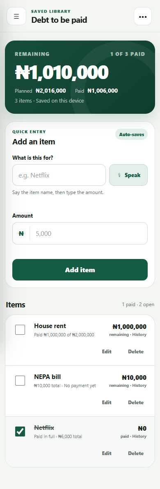
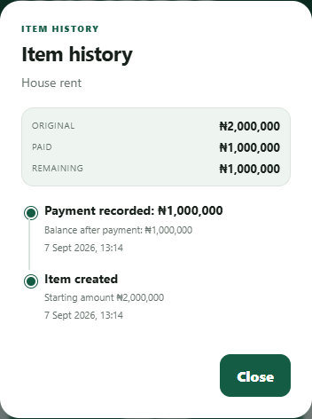

# ListCalc

**An offline-friendly naira calculator and payment tracker for everyday lists.**

ListCalc combines quick arithmetic with named lists for bills, purchases, and amounts owed. It keeps money in integer kobo, so totals and partial payments do not drift because of floating-point rounding. The interface works on phones and desktops, and the browser can install it as a Progressive Web App.



## Try it locally

No build step or account is required. From this folder, start a local web server:

```powershell
python -m http.server 8765
```

Then open <http://localhost:8765>. A web server is needed for the service worker and installable app features. For phone installation and speech recognition, serve the app over HTTPS.

## What it does

- Standard calculator with keyboard support, decimals, percent, sign change, and error recovery.
- Named libraries with item entry, edits, deletion, and a short undo window.
- Planned, paid, and remaining totals with partial payments and dated item history.
- Exact naira and kobo parsing and arithmetic.
- Local saving, an offline app shell, and an installable PWA manifest.
- Optional speech entry for item descriptions; amounts are always typed.
- Safe migration of older saved data, including protection against unknown future versions.



## Engineering choices

| Decision | Reason |
| --- | --- |
| Integer kobo values | Prevent rounding errors in balances and partial payments. |
| Browser storage | Keep personal lists on the device without requiring an account or server. |
| Separate calculation logic | Make the money and migration rules testable without a browser. |
| Typed entry alongside speech | Keep the app usable when speech recognition is unavailable. |

The app uses plain HTML, CSS, and JavaScript. `core.js` contains calculation and data rules; `app.js` handles the interface and persistence. `sw.js` caches the app shell for offline use.

## Tests

Core tests use Node.js built-in test runner:

```powershell
node --test tests/core.test.cjs
```

The optional browser smoke test requires Playwright and Chromium or Chrome. It exercises fresh launch, calculations, payments, history, saved-data migration, offline assets, and phone-sized layout:

```powershell
npm install
npx playwright install chromium
npm run test:browser
```

Keep the local web server running in a separate terminal while running the browser test. If Chrome is already installed and you want to use it, set `LISTCALC_CHROME_PATH` to its executable path. Set `LISTCALC_TEST_URL` to test another address.

## Current limits

- Data stays in each browser's local storage. Export, restore, and cloud sync are not yet available, so clearing browser data can remove saved lists.
- Speech recognition depends on browser support and may use the browser provider's transcription service. ListCalc does not keep audio recordings.
- This repository contains the web app. Android test builds are separate and have not been verified on a physical phone.

## Status

The web app passed 14 core tests and its browser smoke test on 27 September 2026. The browser test covered phone and desktop layouts, payment flows, migration, and offline assets.
